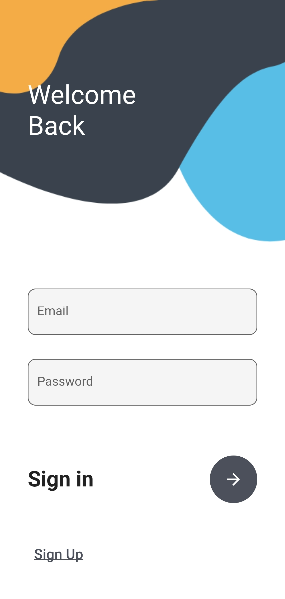
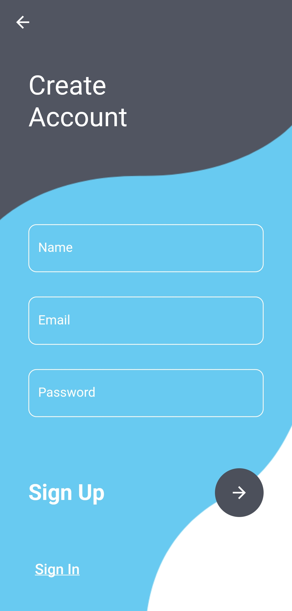
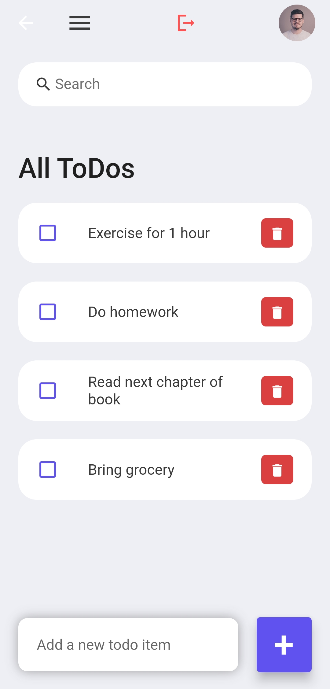
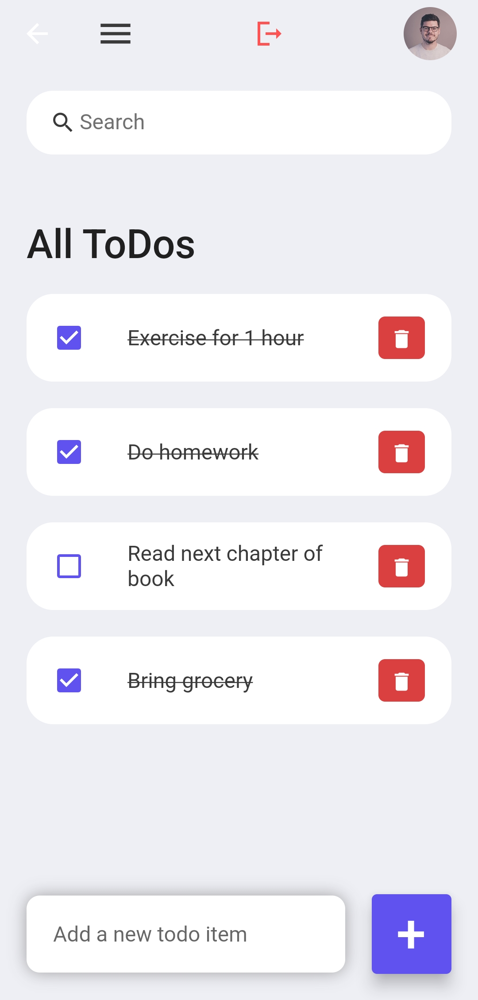

<p align="center">
  <a href="" rel="noopener">
 </a>
</p>

<h3 align="center">ToodleDo</h3>

<div align="center">

[]()


</div>


## 📝 Table of Contents

- [About](#about)
- [Prerequisites](#prerequisites)
- [Setup](#setup)
- [Usage](#usage)
- [Built Using](#built_using)
- [Authors](#authors)
- [Acknowledgments](#acknowledgement)

## 🧐 About <a name = "about"></a>

To-Do List project is an application specially built to keep track of errands or tasks that need to be done.This application will be like a task keeper where the user would be able to enter the tasks that they need to do.Once they are done with their tasks they can also remove them from the list.

## 🏁 Prerequisites <a name = "prerequisites"></a>

Before we begin with our project, we would like you to know the prerequisites for the same so you can understand it.  
We have made our project using :
1. Dart.
2. Flutter.
3. Kotlin.
4. Firebase.
5. Andriod Studio.

### 🔧 Setup <a name = "setup"></a>

1.Clone the repo.
```sh
https://github.com/shivamkshirsagar11/todo_app.git
```

2.Follow the step given in the link to setup the database.
```sh
https://firebase.google.com/docs/flutter/setup?platform=android
```

## 🎈 Usage <a name="usage"></a>


</a><br>
</a><br>
</a><br>
</a><br>


## ⛏️ Built Using <a name = "built_using"></a>

- [Dart](https://dart.dev/)
- [Flutter](https://flutter.dev/)
- [Firebase](https://firebase.google.com/)

## ✍️ Authors <a name = "authors"></a>

- [@shivamkshirsagar11](https://github.com/shivamkshirsagar11)
- [@KaranRaval636](https://github.com/KaranRaval636) 
